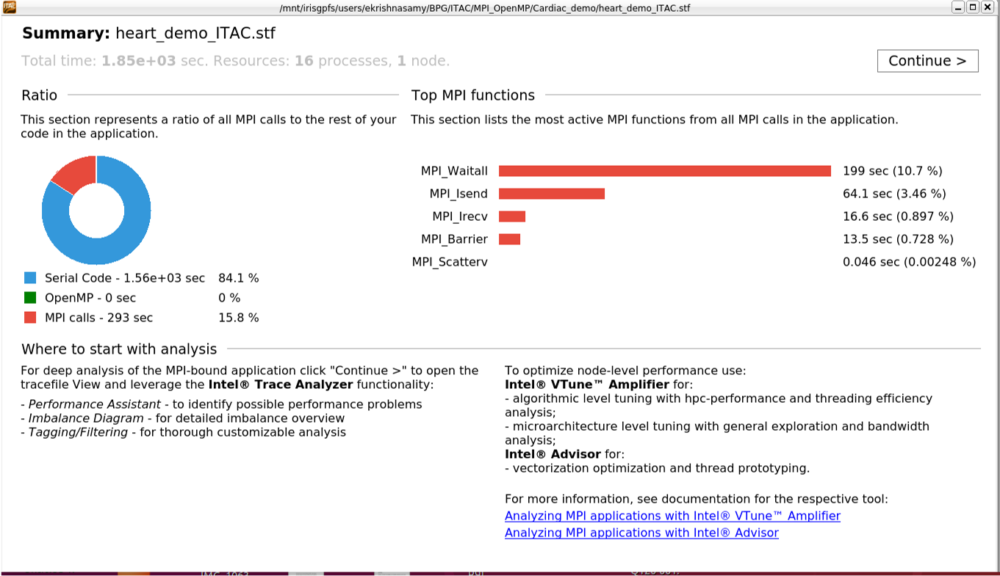
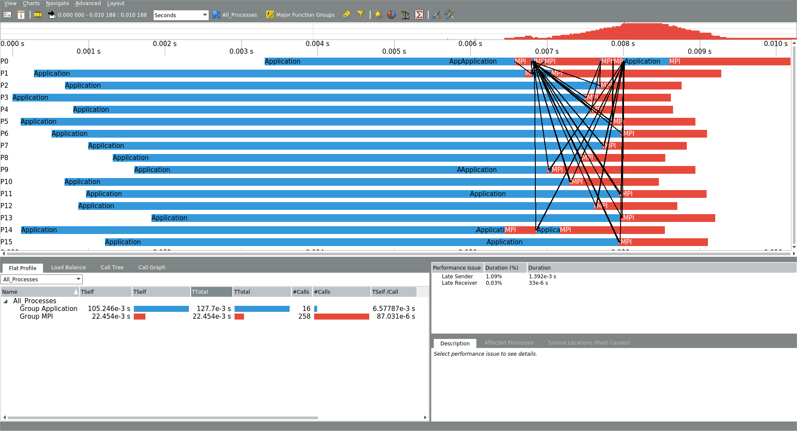

[{: style="width:300px;float: right;" }](https://software.intel.com/content/www/us/en/develop/documentation/get-started-with-itac/top1.html)
Intel [Trace
Analyzer](https://software.intel.com/en-us/ita-user-and-reference-guide) and
[Collector](https://software.intel.com/en-us/itc-user-and-reference-guide)
(ITAC) are two tools used for analyzing MPI behavior in parallel applications.
ITAC identifies MPI load imbalance and communication hotspots in order to help
developers optimize MPI parallelization and minimize communication and
synchronization in their applications. Using Trace Collector on Cori must be
done with a command line interface, while Trace Analyzer supports both a
command line and graphical user interface which analyzes the data from Trace
Collector.


## Environmental models for ITAC in ULHPC

```bash
module load purge
module load swenv/default-env/v1.2-20191021-production
module load toolchain/intel/2019a
module load tools/itac/2019.4.036
module load vis/GTK+/3.24.8-GCCcore-8.2.0
```

## Interactive mode
```bash
# Compilation
$ icc -qopenmp -trance example.c

# Code execution
$ export OMP_NUM_THREADS=16
$ -trace-collective ./a.out

# Report collection
$ export VT_STATISTICS=ON
$ stftool tracefile.stf --print-statistics
```

## Batch mode
### Shared memory programming model (OpenMP)
Example for the batch script:
```bash
#!/bin/bash -l
#SBATCH -J ITAC
#SBATCH -A <project name>
#SBATCH -M --cluster iris 
#SBATCH -N 1
#SBATCH -c 16
#SBATCH --time=00:10:00
#SBATCH -p batch

module purge
module load swenv/default-env/v1.2-20191021-production
module load toolchain/intel/2019a
module load tools/itac/2019.4.036
module load vis/GTK+/3.24.8-GCCcore-8.2.0

$ export OMP_NUM_THREADS=16
$ -trace-collective ./a.out
```

To see the result
```bash
$ export VT_STATISTICS=ON
$ stftool tracefile.stf --print-statistics
```

### Distributed memory programming model (MPI)
To compile
```bash
$ mpiicc -trace example.c
```
Example for the batch script:
```bash
#!/bin/bash -l
#SBATCH -J ITAC
#SBATCH -A <project name>
#SBATCH -N 2
#SBATCH -M --cluster iris 
#SBATCH --ntasks-per-node=28
#SBATCH --time=00:10:00
#SBATCH -p batch

module purge
module load swenv/default-env/v1.2-20191021-production
module load toolchain/intel/2019a
module load tools/itac/2019.4.036
module load vis/GTK+/3.24.8-GCCcore-8.2.0

srun -n ${SLURM_NTASKS} -trace-collective ./a.out
```
To collect the result and see the result in GUI use the below commands
```bash
$ export VT_STATISTICS=ON
$ stftool tracefile.stf --print-statistics
```







!!! tip
    If you find some issues with the instructions above,
    please report it to us using [support ticket](https://hpc.uni.lu/support).