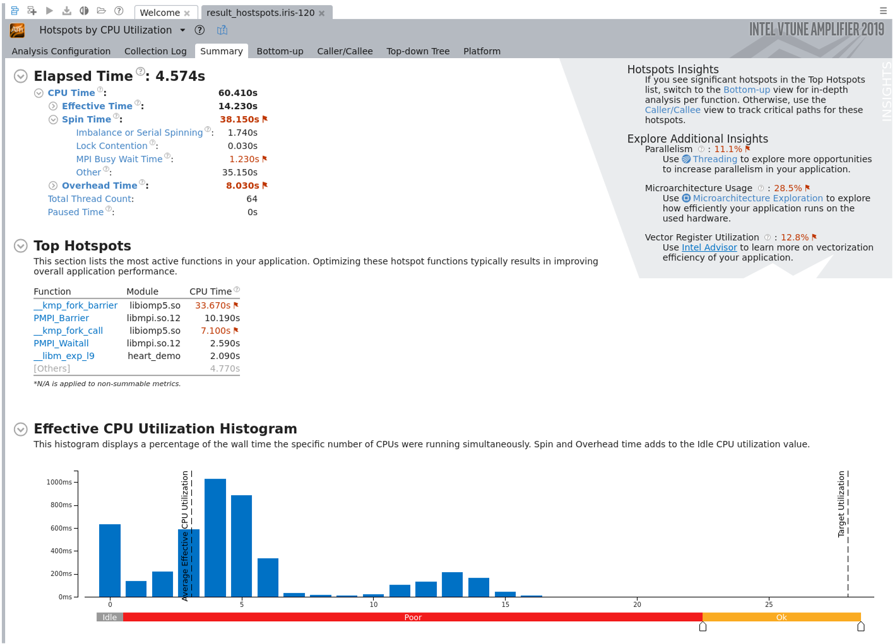

# VTune

## Introduction

See the [Intel VTune Amplifier documentation](https://software.intel.com/en-us/vtune-help) for general usage.

!!! tip "VTune command name changes in version 2020"
	Version 2020 of VTune includes several significant upgrades in 
	functionality. It also includes some command name changes. The 
	command line interface to VTune has changed from `amplxe-cl` to 
	simply `vtune`, and the GUI has changed from `amplxe-gui` to 
	`vtune-gui`. Intel provides symbolic links such that the old 
	commands `amplxe-cl` and `amplxe-gui` will continue to work, 
	but those symbolic links may be removed in a future version.


!!! tip "Recommended compiler flags for VTune performance collection"
    Intel provides a
    [page](https://software.intel.com/en-us/vtune-help-compiler-switches-for-performance-analysis-on-linux-targets)
    documenting their recommended compiler flags for compiling applications
    when collecting performance data with VTune. Users will generally have the
    best results when compiling codes using the Intel compilers, although the
    [CCE](../../compilers/native#cray) and [GCC](../../compilers/native/#gnu)
    compilers can also produce application suitable for analysis with VTune.

When collecting performance data with VTune, it is **strongly
recommended** to add the Slurm flag `--perf=vtune` or
`--perf=<vtune_module_version>` to your job allocation, where
`<vtune_module_version>` is the full module name of the VTune version
you want to use.

!!! warning 
	Certain VTune collections can function without the 
	`#SBATCH --perf=vtune` flag, but many others will fail.

!!! tip "Defer finalization" 
	It is generally recommended to defer finalization when running 
	on KNL. Finalization is an inherently serial process and the 
	individual core performance on KNL is very poor. Thus, when 
	running VTune on KNL, add the parameter	`-finalization-mode=deferred`

## Environmental models for VTune on UL-HPC:
```bash
module purge 
module load swenv/default-env/v1.2-20191021-production
module load toolchain/intel/2019a
module load tools/VTune/2019_update4
module load vis/GTK+/3.24.8-GCCcore-8.2.0
```


## Interactive Mode

```bash
# Compilation
$ icc -qopenmp example.c

# Code execution
$ export OMP_NUM_THREADS=16
$ amplxe-cl -collect hotspots -r my_result ./a.out
```
To see the result in GUI `$ amplxe-gui my_result`


`$ amplxe-cl` will list out the analysis types and `$ amplxe-cl -hlep report` will list out available reports in VTune.

## Batch Mode

### Shared Memory Programming Model (OpenMP)
```bash
#!/bin/bash -l
#SBATCH -J VTune
#SBATCH -N 1
#SBATCH -c 28
#SBATCH --time=00:10:00
#SBATCH -p batch

module purge 
module load swenv/default-env/v1.2-20191021-production
module load toolchain/intel/2019a
module load tools/VTune/2019_update4
module load vis/GTK+/3.24.8-GCCcore-8.2.0

export OMP_NUM_THREADS=16
amplxe-cl -collect hotspots-r my_result ./a.out
```

### Distributed Memory Programming Model

To compile just `MPI` application run `$ mpiicc example.c`
and for `MPI+OpenMP` run `$ mpiicc -qopenmp example.c`

```bash
#!/bin/bash -l
#SBATCH -J VTune
#SBATCH -N 2
#SBATCH --ntasks-per-node=56
#SBATCH --time=00:10:00
#SBATCH -p batch

module purge 
module load swenv/default-env/v1.2-20191021-production
module load toolchain/intel/2019a
module load tools/VTune/2019_update4
module load vis/GTK+/3.24.8-GCCcore-8.2.0

srun -n 56 amplxe-cl -collect uarch-exploration -r vtune_mpi -- ./a.out
```

```bash
# Report collection
$ amplxe-cl -report uarch-exploration -report-output output -r vtune_mpi

# Result visualization 
$ amplxe-gui vtune_mpi
```
The below figure shows the hybrid(MPI+OpenMP) programming analysis results:




