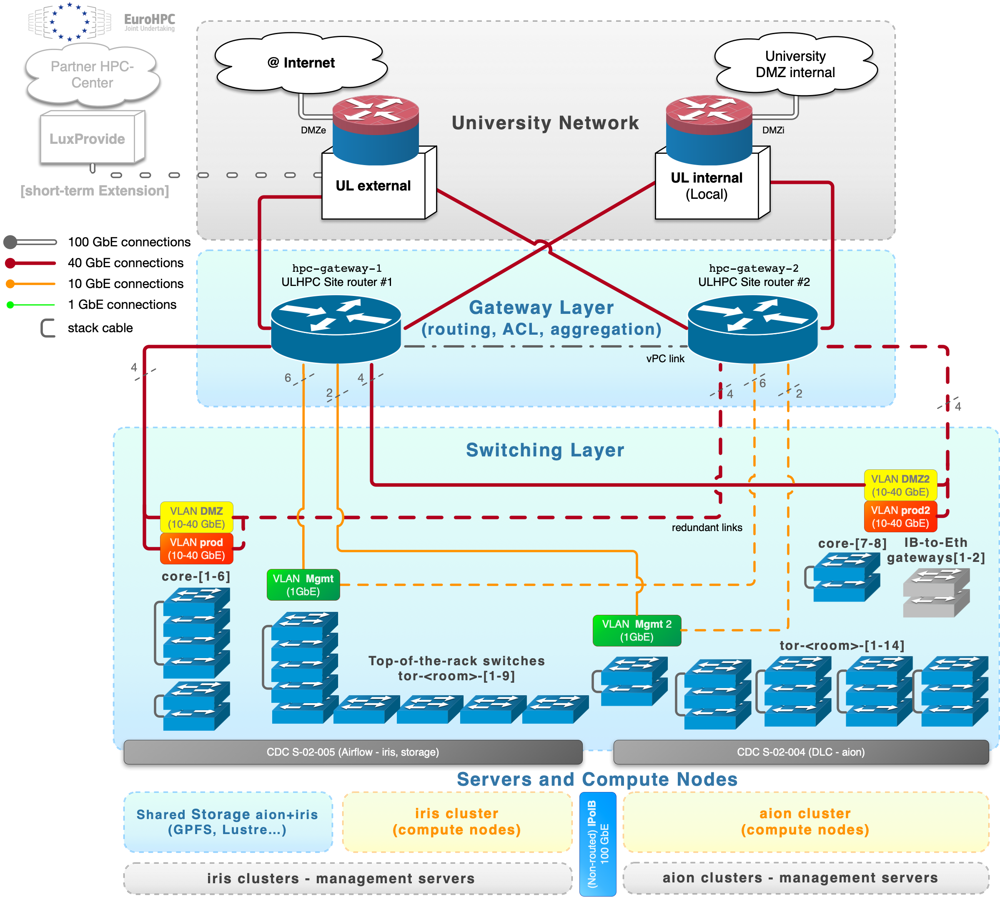

# Ethernet Network

Having a single high-bandwidth and low-latency network as the [local Fast IB interconnect network](ib.md) to support efficient HPC and Big data workloads would not provide the necessary flexibility brought by the Ethernet protocol.
Especially applications that are not able to employ the native protocol foreseen for that network and thus forced to use an IP emulation layer will benefit from the flexibility of Ethernet-based networks.

An additional, Ethernet-based network offers the robustness and resiliency needed for management tasks inside the system in such cases

Outside the [Fast IB interconnect network](ib.md) used **inside** the clusters, we maintain an Ethernet network organized as a 2-layer topology:

1. one upper level (__Gateway Layer__) with routing, switching features, network isolation and filtering (ACL) rules and meant to interconnect _only_ switches.
     - This layer is handled by a redundant set of site routers (ULHPC gateway routers).
     - it allows to interface the University network for both internal (LAN) and external (WAN) communications
2. one bottom level (__Switching Layer__) composed by the [stacked] _core_ switches as well as the _TOR_ (Top-the-rack) switches, meant to interface the HPC servers and compute nodes.

An overview of this topology is provided in the below figure.

