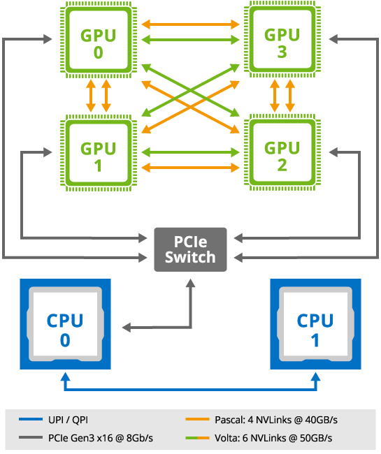

# ULHPC GPU Nodes

Each GPU node provided as part of the [`gpu` partition](../slurm/partition.md) feature **4x Nvidia V100 SXM2** (with either 16G or 32G memory) interconnected by the [NVLink 2.0](https://www.nvidia.com/en-us/data-center/nvlink/) architecture

NVlink was designed as an alternative solution to PCI Express with higher bandwidth and additional features (e.g., shared memory) specifically designed to be compatible with Nvidia's own GPU ISA for multi-GPU systems -- see [wikichip article](https://en.wikichip.org/wiki/nvidia/nvlink).

{: style="width:325px;"}

Because of the hardware organization, you **MUST** follow the below recommendations:

1. **Do not run jobs on GPU nodes if you have no use of GPU accelerators!**, _i.e._ if you are not using any of the software compiled against the `{foss,intel}cuda` toolchain.
2. Avoid using more than 4 GPUs, ideally within the same node
3. Dedicated 1/4 of the available CPU cores for the management of each GPU card reserved.

Thus your typical GPU launcher would match the [AI/DL launcher](../slurm/launchers.md#specialized-bigdatagpu-launchers) example:

```bash
#!/bin/bash -l
### Request one GPU tasks for 4 hours - dedicate 1/4 of available cores for its management
#SBATCH -N 1
#SBATCH --ntasks-per-node=1
#SBATCH -c 7
#SBATCH -G 1
#SBATCH --time=00:04:00
#SBATCH -p gpu

[...]
```


You can quickly access a GPU node for [interactive jobs](../jobs/interactive.md) using `si-gpu`.
