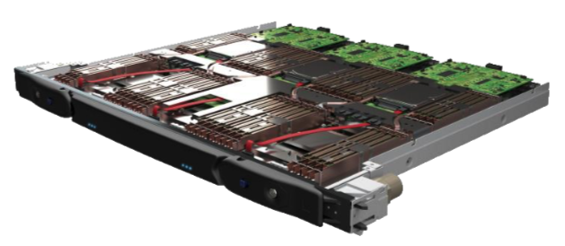

# Aion Compute Nodes

Aion is a cluster of x86-64 AMD-based compute nodes.
More precisely, Aion consists of 318 "_regular_" computational nodes named `aion-[0001-0318]` as follows:

| Hostname           (#Nodes)  | #cores | type                        | Processors                                                                                     | RAM    | $R_\text{peak}$ <small>[TFlops]</small>  |
|------------------------------|--------|-----------------------------|------------------------------------------------------------------------------------------------|--------|----------------------------------------------|
| `aion-[0001-0318]`     (318) |  40704 | Regular <small>Epyc</small> | 2 [AMD Epyc ROME 7H12](https://www.amd.com/en/products/cpu/amd-epyc-7h12) @ 2.6 GHz [64c/280W] | 256 GB | 5.32 TF                                      |

## Processor Performance

Each Aion node rely on an AMD Epyc Rome processor architecture which is binary compatible with the x86-64 architecture.
Each processor has the following performance:

| Processor Model                                                         | #cores | TDP(*) | CPU Freq. | $R_\text{peak}$ <small>[TFlops]</small> | $R_\text{max}$ <small>[TFlops]</small> |
|-------------------------------------------------------------------------|--------|--------|-----------|---------------------------------------------|--------------------------------------------|
| [AMD Epyc ROME 7H12](https://www.amd.com/en/products/cpu/amd-epyc-7h12) |     64 | 280W   | 2.6 GHz   | 2,66 TF                                     | 2,13 TF                                    |

<small>(*) The _Thermal Design Power_ (TDP) represents the average power, in watts, the processor dissipates when operating at Base Frequency with all cores active under an Intel-defined, high-complexity workload.</small>

??? info "Theoretical $R_\text{peak}$ vs. Maximum $R_\text{max}$ Performance for AMD Epyc"
    The **AMD Epyc** processors carry on **16 Double Precision (DP) ops/cycle**.
    Thus the reported $R_\text{peak}$ performance is computed as follows:
    $R_\text{peak} = ops/cycle \times Freq. \times \#Cores$

    With regards the _estimation_ of the Maximum Performance $R_\text{max}$, an efficiency factor of 80% is applied.
    It is computed from the expected performance runs during the [HPL](http://www.netlib.org/benchmark/hpl/index.html) benchmark workload.

## Regular Dual-CPU Nodes

These nodes are packaged within [BullSequana X2410 AMD compute blades](BullSequanaXH2000_Features_Atos_supercomputers.pdf).

{: style="width:300px;float: right;" }

Each blade contains 3 dual-socket AMD Rome nodes side-by-side, connected to the BullSequana XH2000 local interconnect network through HDR100 ports which is done through a mezzanine board.
The BullSequana AMD blade is built upon a cold plate which cools all components by direct contact, except DIMMS for which custom heat spreaders evacuate the heat to the cold plate -- see [exploded view](index.md#cooling)
Characteristics of each blade and associated compute nodes are depicted in the below table

|                         | BullSequana X2410 AMD blade                                                                    |
|-------------------------|------------------------------------------------------------------------------------------------|
| Form Factor             | 1U blade comprising 3 compute nodes side-by-side                                               |
| #Nodes per blade        | 3                                                                                              |
| Processors per node     | 2x [AMD Epyc ROME 7H12](https://www.amd.com/en/products/cpu/amd-epyc-7h12) @ 2.6 GHz [64c/280W] |
| Architecture            | AMD SP3 Platform: 3x1 motherboard                                                              |
| Memory per node         | 256 GB DDR4 3200MT/s (8x16 GB DIMMs _per socket_, 16 DIMMs per node)                           |
| Network (per node)      | InfiniBand HDR100 single port mezzanine                                                        |
| Storage (per node)      | 1x 480 GB SSD                                                                                  |
| Power supply            | PSU shelves on top of XH2000 cabinet                                                           |
| Cooling                 | Cooling by direct contact                                                                      |
| Physical specs. (HxWxD) | 44.45 x 600 x 540 mm                                                                           |

The four compute racks of Aion (one XH2000 Cell) holds a total of 106 blades _i.e.,_ 318 [AMD Epyc](https://www.amd.com/en/products/epyc) compute nodes, totalling 40704 computing core  -- see [Aion configuration](index.md#data-center-configuration).

