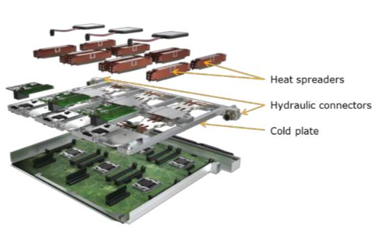

# Aion Overview

[{: style="width:400px;float: right;margin-right:10px" }](BullSequanaXH2000_Features_Atos_supercomputers.pdf)

Aion is a [Atos/Bull](https://atos.net/en/solutions/high-performance-computing-hpc)/AMD supercomputer which consists of **318 compute nodes, totaling 40704 compute cores** and 81408 GB RAM,
with a peak performance of about **1,693 PetaFLOP/s**.

All nodes are interconnected through a **Fast InfiniBand (IB) HDR100 network**[^1], configured over a ** [Fat-Tree](https://clusterdesign.org/fat-trees/) Topology** (blocking factor 1:2).
Aion nodes are equipped with [AMD Epyc ROME 7H12](https://www.amd.com/en/products/cpu/amd-epyc-7h12) processors.

[^1]: Infiniband (IB) HDR networks offer a 200 Gb/s throughput with a very low latency (0,6$\mu$s). The HDR100 technology allows one 200Gbps HDR port (aggregation 4x 50Gbps) to be divided into 2 HDR100 ports with 100Gbps (2x 50Gbps) bandwidth using an [optical] ["_splitter_" cable](https://www.mellanox.com/related-docs/prod_cables/PB_MFS1S50-HxxxE_200Gbps_QSFP56_to_2x100Gbps_QSFP56_AOC.pdf).

Two global [_high_-performance clustered file systems](../../filesystems/index.md) are available on all ULHPC computational systems: one based on GPFS/SpectrumScale, one on Lustre.

[:fontawesome-solid-sign-in-alt: Aion Compute](compute.md){: .md-button .md-button--link } [:fontawesome-solid-sign-in-alt: Aion Interconnect](interconnect.md){: .md-button .md-button--link } [:fontawesome-solid-sign-in-alt: Global Storage](../../filesystems/index.md){: .md-button .md-button--link }

The cluster runs a [Red Hat Linux](https://www.redhat.com/) operating system.
The ULHPC Team supplies on all clusters a large variety of HPC utilities, scientific applications and programming libraries to its user community.
The [user software environment](../../software/index.md) is generated using [Easybuild](https://easybuild.readthedocs.io) (EB) and is made available as [environment modules](../../environment/modules.md) from the compute nodes only.

[Slurm](https://slurm.schedmd.com/documentation.html) is the Resource and Job Management Systems (RJMS) which provides computing resources allocations and job execution.
For more information: see [ULHPC slurm docs](../../slurm/index.md).

## Cluster Organization

### Data Center Configuration

The Aion cluster is based on a cell made of 4 [BullSequana XH2000](https://atos.net/en/solutions/high-performance-computing-hpc/bullsequana-x-supercomputers) adjacent racks installed in the [CDC (_Centre de Calcul_) data center of the University](../../data-center/index.md) within one of the DLC-enabled server room (CDC S-02-004) adjacent to the room hosting the [Iris](../iris/index.md) cluster and the [global storage](../../filesystems/index.md).

Each rack has the following dimensions: HxWxD (mm) = 2030x750x1270 (Depth is 1350mm with aesthetic doors).
The full solution with 4 racks (total dimension: dimensions: HxWxD (mm) = 2030x3000x1270) with the following characteristics:

|                              |    Rack 1 |    Rack 2 |    Rack 3 |    Rack 4 | __TOTAL__      |
|------------------------------|-----------|-----------|-----------|-----------|----------------|
| __Weight [kg]__              |    1872,4 |    1830,2 |    1830,2 |    1824,2 | __7357 kg__    |
| __#X2410 Rome Blade__        |        28 |        26 |        26 |        26 | __106__        |
| __#Compute Nodes__           |        84 |        78 |        78 |        78 | __318__        |
| __#Compute Cores__           |     10752 |      9984 |      9984 |      9984 | __40704__      |
| __$R_\text{peak}$ [TFlops]__ | 447,28 TF | 415,33 TF | 415,33 TF | 415,33 TF | __1693.29 TF__ |

For more details: [:fontawesome-solid-sign-in-alt: BullSequana XH2000 SpecSheet (PDF)](BullSequanaXH2000_Features_Atos_supercomputers.pdf){: .md-button .md-button--link }

### Cooling

The BullSequana XH2000 is a fan less innovative cooling solution which is ultra-energy-efficient (targeting a PUE very close to 1) using an enhanced version of the Bull [Direct Liquid Cooling (DLC)](../../data-center/index.md#direct-liquid-cooling) technology.
A separate **hot**-water circuit minimizes the total energy consumption of a system. For more information: see [[Direct] Liquid Cooling](../../data-center/index.md#direct-liquid-cooling).

The illustration on the right shows an exploded view of a compute blade with the cold plate and heat spreaders.
{: style="width:300px;float: right;" }
The DLC[^1] components in the rack are:

* Compute nodes (CPU, Memory, Drives, GPU)
* High Speed Interconnect: HDR
* Management network: Ethernet management switches
* Power Supply Unit: DLC shelves

The cooling area in the rack is composed of:

* 3 Hydraulic chassis (HYCs) for 2+1 redundancy at the bottom of the cabinet, 10.5U height.
   - Each HYCs dissipates at a maximum of 240W in the air.
* A primary manifold system connects the University hot-water loop to the HYCs primary water inlets
* A secondary manifold system connects HYCs outlets to each blade in the compute cabinet

[^1]: All DLC components are built on a cold plate which cools all components by direct contact, except DIMMS for which custom heat spreaders evacuate the heat to the cold plate.

## Login/Access servers

* Aion has 2 access servers (256 GB of memory each, general access) `access[1-2]`
   - Each login node has two sockets, each socket is populated with an [AMD EPYC 7452](https://www.amd.com/fr/products/cpu/amd-epyc-7452) processor (2.2 GHz, 32 cores)

!!! warning "Access servers are not meant for compute!"
    - The `module` command is not available on the access servers, only on the compute nodes
    - **you MUST NOT run any computing process on the access servers**.

## Rack Cabinets

The Aion cluster (management compute and interconnect) is installed across the two adjacent server rooms in the premises of the [_Centre de Calcul_](../../data-center/index.md) (CDC), in the CDC-S02-005 server room.

| Server Room | Rack ID | Purpose    | Type    | Description                      |
|-------------|---------|------------|---------|----------------------------------|
| CDC-S02-005 | D02     | Network    |         | Interconnect equipment           |
| CDC-S02-005 | A04     | Management |         | Management servers, Interconnect |
| CDC-S02-004 | A01     | Compute    | regular | `aion-[0001-0084]`, interconnect |
| CDC-S02-004 | A02     | Compute    | regular | `aion-[0085-0162]`, interconnect |
| CDC-S02-004 | A03     | Compute    | regular | `aion-[0163-0240]`, interconnect |
| CDC-S02-004 | A04     | Compute    | regular | `aion-[0241-0318]`, interconnect |

In addition, the global storage equipment ([GPFS/SpectrumScale](../../filesystems/gpfs.md) and [Lustre](../../filesystems/lustre.md), common to both Iris and [Aion](../aion/index.md) clusters) is installed in another row of cabinets of the same server room.
